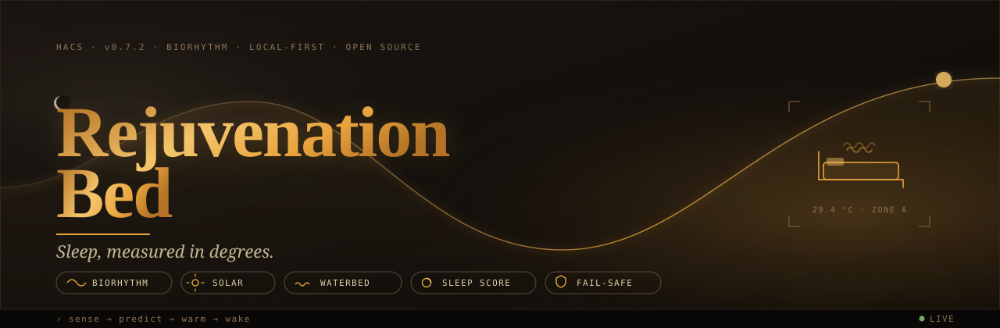

<div align="center">



# 🛏️ Rejuvenation Bed

**A self-learning sleep AI for any heated bed.**

Biorhythm-based temperature curve, learned bedtime prediction, solar surplus stored as heat, presence detection without extra sensors, and a fail-safe that survives every sensor it depends on. Works with waterbeds, heating pads and heated mattress toppers.

[](https://github.com/hacs/integration)
[](https://github.com/Chance-Konstruktion/ha-rejuvenation-bed/releases)
[](LICENSE)
[](https://www.home-assistant.io/)

[Quick Start](#-quick-start) · [Highlights](#-highlights) · [Architecture](#-architecture) · [Entities](#-entities--services) · [FAQ](#-faq) · [🇩🇪 Deutsch](README_DE.md)

</div>

> ### 🌒 → [**Open the editorial reading room**](https://chance-konstruktion.github.io/ha-rejuvenation-bed/)
> The full dark editorial site with animated biorhythm curve — the whole story.
> *(Source: [`docs/index.html`](docs/index.html))*

---

## ✦ Why this exists

> Your bed has one job at night — and most heaters do it like a 1980s radiator: a single number, on or off, all night long.

A human body doesn't sleep at a constant temperature. It cools 1–2 °C on the way into deep sleep, warms again before the alarm, and reacts to season, partner, illness and a hundred small signals. A waterbed has the inertia of a thermal flywheel; a heating pad reacts in seconds. The same target temperature is wrong for both, and wrong for any one of them across a whole night.

<table>
<tr>
<td width="33%" valign="top">

### 🌙 Follows the rhythm
A chronotype-aware curve that warms for falling asleep, dips for deep sleep, and rises again before the alarm — instead of holding a fixed setpoint.

</td>
<td width="33%" valign="top">

### ☀️ Charges with the sun
PV surplus is parked in the water body as a thermal battery. The night you've already paid for in daylight is the night you sleep through.

</td>
<td width="33%" valign="top">

### 🛡️ Degrades gracefully
Every optional sensor — humidity, surface temp, power — can fail without taking the heater with it. Overheat protection, anti-short-cycle and leak alarm are non-negotiable.

</td>
</tr>
</table>

---

## ⌁ Highlights

<table>
<tr>
<td width="50%" valign="top">

**🕯️ Biorhythm curve** — Chronotype-aware sleep phase model (early bird / normal / night owl) with seasonal adjustment from outdoor temperature.

</td>
<td width="50%" valign="top">

**⏰ Alarm-aware wake** — Phone alarm, fixed time or hybrid. The bed warms _toward_ your wake time, not _at_ it.

</td>
</tr>
<tr>
<td valign="top">

**🌗 Dual-zone for partners** — Two sleep profiles, two curves, one bed. Different chronotypes welcome.

</td>
<td valign="top">

**🪫 Thermal battery** — Solar surplus is stored as heat. Tracked as a 0–100 % charge sensor.

</td>
</tr>
<tr>
<td valign="top">

**💶 Dynamic tariffs** — Tibber, Octopus, ENTSO-E or a fixed rate. Auto-reduces during expensive hours.

</td>
<td valign="top">

**👤 Sensor-less presence** — Detects you in bed via water temperature variance. No PIR, no mattress sensor.

</td>
</tr>
<tr>
<td valign="top">

**🎯 Auto-calibration** — Learns your bed and your bedtime in 3–5 days. No manual offset tuning.

</td>
<td valign="top">

**📊 Sleep score 0–100** — Per night, per week. Cross-correlation catches sweat, condensation and leak suspicion.

</td>
</tr>
</table>

---

## ☾ Architecture

```
                        coordinator.py
                        60-second loop
                              │
        ┌─────────────────────┼─────────────────────┐
        │                     │                     │
   safety_manager     temperature_calculator   energy_state_resolver
   overheat · grace      biorhythm curve        solar · tariff · normal
   fail-safe · cycle           │
                               │
                ┌──────────────┼──────────────┐
                │              │              │
        biorhythmus_curve  wake_time_     sleep_stage_
        chronotype model    resolver        resolver
                            (alarm /        (wearable)
                             fixed /
                             hybrid)

   presence_detector  ←  bed_intelligence  →  diagnostics_manager
   variance-based         calibration ·         energy budget ·
                          insulation ·          thermal summary
                          sweat · bedtime
                          learning

        ramp_controller     anti_short_cycle     sleep_score
        vinyl protection    relay protection     0–100 rating
```

<details>
<summary><b>22 modules · bilingual (DE/EN) · HACS-compatible</b></summary>

The coordinator is the only thing that talks to Home Assistant; every module below it is pure logic, unit-testable in isolation. Sensors are advisory — the safety manager has the final word on the heater switch.

</details>

---

## ⚙ Quick Start

### 1 · Install via HACS

```
HACS → Integrations → ⋮ → Custom Repositories
URL:      https://github.com/Chance-Konstruktion/ha-rejuvenation-bed
Category: Integration
```

Then **Install → Restart Home Assistant**.

### 2 · Add the integration

```
Settings → Devices & Services → Add Integration → Rejuvenation Bed
```

The setup wizard asks for your heater switch first. Everything else is optional — you can come back later via the options flow.

### 3 · Pick a hardware level

| Level | What you have                       | What you get |
| :---: | :---------------------------------- | :----------- |
| **A** | A smart plug                        | Timer · boost · vacation |
| **B** | + water/pad temperature sensor      | + biorhythm · presence · sleep score |
| **C** | + power sensor                      | + energy tracking · sharper presence |
| **D** | + SHT41 (air/humidity)              | + insulation check · sweat detection · leak alarm |

> 💡 **Not technical?** Level A is one smart plug and one screen. The integration upgrades itself as you add sensors — nothing to reconfigure.

---

## ✦ Configuration

The options flow is split into four panes — each one a single page, no nesting.

<details>
<summary><b>🌐 Global Settings</b> — times, temperatures, sensors, electricity price</summary>

<br>

Split into two cards:

- **Times & Temperature** — warm window, summer threshold, manual offset, bed water volume in litres.
- **Sensors & Electricity Price** — solar production sensor, dynamic price sensor or fixed tariff (ct/kWh), grid CO₂ intensity.

</details>

<details>
<summary><b>📡 Zone Sensors</b> — hardware per zone</summary>

<br>

Per zone (one zone for single beds, two for dual-core waterbeds):

| Field             | Required | Notes |
| :---------------- | :------: | :--- |
| Heater switch     |    ✓     | Any `switch` or `input_boolean` |
| Temperature       |          | DS18B20 in the water, or a thermistor on the pad |
| Power             |          | Smart plug with energy metering |
| Presence override |          | Falls back to variance-based detection if missing |
| Humidity          |          | SHT41 — enables sweat / leak / insulation logic |
| Surface temp      |          | SHT41 — enables condensation alarm |

</details>

<details>
<summary><b>🌡️ Sleep Profile</b> — per zone</summary>

<br>

- Alarm entity (phone or HA `input_datetime`)
- Weekend sleep-in offset
- Sleep temperatures — leave empty for seasonal automatic
- Wearable sensor (optional sleep stage feed)

</details>

<details>
<summary><b>🎛️ Special Modes</b> — sick, boost, vacation, comfort</summary>

<br>

- **Sick** — constant temperature for N days
- **Boost** — target + offset for 60 min
- **Vacation** — minimal 24 °C holding (frost / condensation protection)
- **Comfort** — sleep-in offset for weekends and off-days

</details>

---

## ⚡ Entities & Services

<details>
<summary><b>🛏️ Rejuvenation Bed</b> — main device</summary>

<br>

| Entity                              | Description |
| :---------------------------------- | :--- |
| `climate.rejuvenation_bed`          | Thermostat with target temperature and HVAC mode |
| `sensor.bett_zieltemperatur`        | Calculated target temperature |
| `sensor.bett_status`                | Current mode and decision reason |
| `sensor.bett_thermal_summary`       | Temperature calculation breakdown |
| `binary_sensor.bett_prasenz`        | Person in bed |
| `binary_sensor.bett_isolation`      | Bed covered (requires SHT41) |
| `switch.bett_boost`                 | Quick heat |
| `switch.bett_krank_modus`           | Sick mode |
| `switch.bett_tarifmodus`            | Tariff mode (reduces during expensive rates) |

</details>

<details>
<summary><b>⚡ Bed Energy</b></summary>

<br>

| Entity                              | Description |
| :---------------------------------- | :--- |
| `sensor.bett_leistung`              | Current power per zone (W) |
| `sensor.bett_gesamtleistung`        | Total power all zones (W) |
| `sensor.bett_thermische_batterie`   | Thermal storage charge level (%) |
| `sensor.bett_energie_heute`         | Consumption today (kWh) |
| `sensor.bett_heizstunden`           | Heating hours today |
| `sensor.bett_ersparnis`             | Estimated savings (€) |
| `sensor.bett_solar_prozent`         | Solar share of consumption |
| `sensor.bett_strompreis_status`     | Current tariff mode |
| `switch.bett_solar_batterie`        | Thermal battery |
| `switch.bett_urlaub_modus`          | Vacation mode |

</details>

<details>
<summary><b>😴 Bed Sleep / Analysis</b></summary>

<br>

| Entity                                 | Description |
| :------------------------------------- | :--- |
| `sensor.bett_schlaf_score`             | Last night (0–100) |
| `sensor.bett_schlaf_score_woche`       | Weekly average |
| `sensor.bett_rampe`                    | Heat-up ramp status |
| `sensor.bett_intelligence`             | Calibration and learning status |
| `binary_sensor.bett_degraded_mode`     | Degraded mode (sensor failure) |
| `binary_sensor.bett_kondensationsrisiko` | Condensation risk (< 24 °C) |
| `binary_sensor.bett_leckage_verdacht`  | Leak suspicion |
| `binary_sensor.bett_schwitzen`         | Sweat / moisture alarm |
| `binary_sensor.bett_system_status`     | System health |

</details>

<details>
<summary><b>🛠 Services</b></summary>

<br>

| Service                                | Description |
| :------------------------------------- | :--- |
| `rejuvenation_bed.set_boost`           | Activate quick heat (duration configurable) |
| `rejuvenation_bed.set_sick_mode`       | Sick mode (temperature + days) |
| `rejuvenation_bed.set_vacation_mode`   | Vacation mode (temperature + end date) |
| `rejuvenation_bed.cancel_special_mode` | Cancel all special modes |
| `rejuvenation_bed.preheat_bed`         | Preheat bed (temperature + duration) |
| `rejuvenation_bed.reset_energy_budget` | Reset energy statistics |

</details>

<details>
<summary><b>🎚 Special Modes</b> — activation cheat-sheet</summary>

<br>

| Mode         | Activation                                      | Effect |
| :----------- | :---------------------------------------------- | :--- |
| **Boost**    | `switch.bett_boost`                             | Target + offset for 60 min |
| **Sick**     | `switch.bett_krank_modus`                       | Constant temperature for N days |
| **Vacation** | `switch.bett_urlaub_modus` or service           | Minimal 24 °C holding temperature |
| **Solar**    | `switch.bett_solar_batterie`                    | Store PV surplus as heat |
| **Tariff**   | `switch.bett_tarifmodus`                        | Reduce during expensive rates |

</details>

---

## 🌒 Dashboards

Two ready-made templates live in `dashboards/`.

<details>
<summary><b>Lovelace YAML — Nightstand Cockpit</b></summary>

<br>

`dashboards/rejuvenation_bed_nightstand_cockpit.yaml` — mobile/tablet-friendly Lovelace template. Adjust the entity IDs to your installation.

</details>

<details>
<summary><b>Standalone HTML — Premium Dashboard</b></summary>

<br>

`dashboards/premium_nightstand_dashboard.html` — standalone React/HTML dashboard with mini view below 800 px.

Embed as a panel:

```yaml
panel_iframe:
  waterbed_cockpit:
    title: Waterbed Cockpit
    icon: mdi:bed-outline
    url: /local/rejuvenation_bed/premium_nightstand_dashboard.html
```

Or as an iframe card:

```yaml
type: iframe
url: /local/rejuvenation_bed/premium_nightstand_dashboard.html
aspect_ratio: 100%
```

Copy the file to `/config/www/rejuvenation_bed/`.

</details>

---

## ❓ FAQ

<details>
<summary><b>Does this only work with waterbeds?</b></summary>

<br>

No. Any electric bed heater works — waterbed, heating pad, heated mattress topper. The biorhythm principle is universal; only the presence-detection strategy differs.

</details>

<details>
<summary><b>Do I need a temperature sensor?</b></summary>

<br>

Recommended. Without one, the system runs as an intelligent timer (Level A). With one, the full biorhythm curve and presence detection unlock.

</details>

<details>
<summary><b>What happens if a sensor fails?</b></summary>

<br>

The integration degrades automatically. The SHT41 can fail without affecting heating. Even the water temperature sensor has a fail-safe — a 30 % duty cycle fallback that keeps the bed warm but safe.

</details>

<details>
<summary><b>How does presence detection work on a heating pad?</b></summary>

<br>

Waterbeds use variance analysis inside the water body. Heating pads use the **temperature trend**: if the heater is off and the surface keeps rising, a body is on it. This needs a pad-mounted thermistor. Without a sensor, presence detection is disabled and the system runs as a Level-A timer. After a ~3-minute settling time, detection is reliable, if a touch less precise than on a waterbed.

</details>

<details>
<summary><b>Which temperature sensors do you recommend?</b></summary>

<br>

DS18B20 waterproof — in the water — plus an optional SHT41 on top of the core for humidity / surface temperature / leak detection.

</details>

---

## 🤝 Contributing

Issues and PRs are welcome. The Python core is fully unit-tested; please run `pytest` before opening a PR. Bilingual contributions (DE/EN) are appreciated but not required.

## 📄 License

[MIT](LICENSE) — do what you like, attribution appreciated.

---

<div align="center">

<sub>Built with real sensor data from a 2 × 2 m dual-core waterbed.<br>Calibrated on 126,771 data points · slept on every night since.</sub>

</div>
