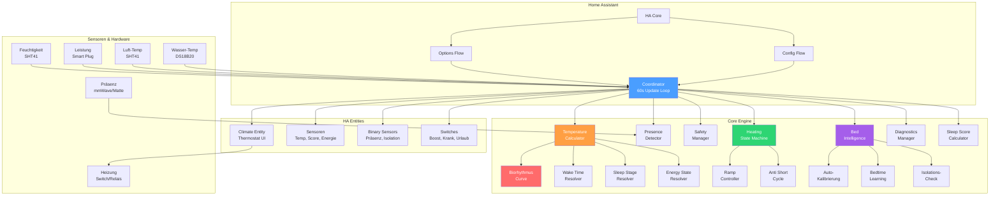
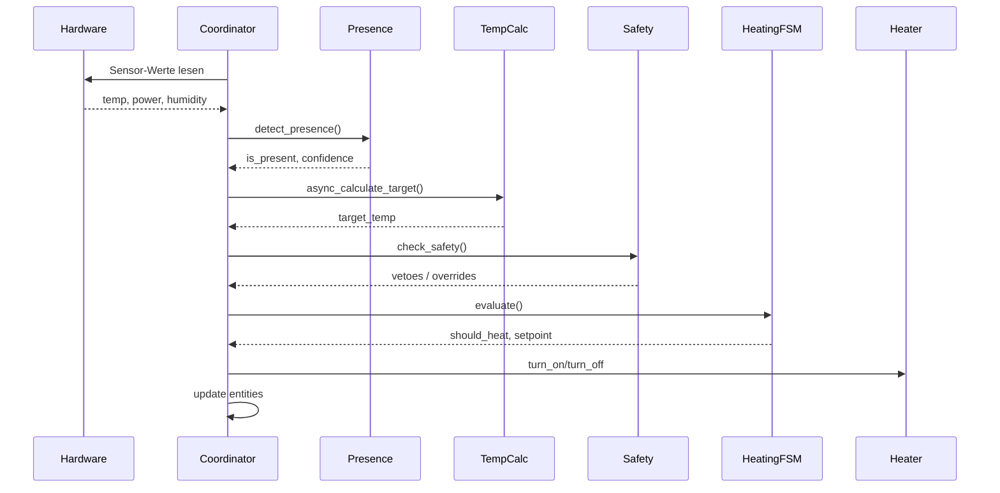
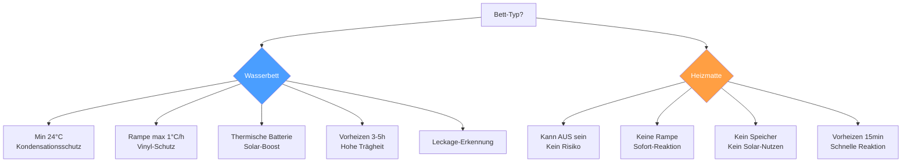

# Architektur – Rejuvenation Bed

## Systemübersicht

## Datenfluss (60s Update Loop)

## Bett-Typ Entscheidungsbaum

## Entity-Übersicht

| Device | Entity | Typ | Beschreibung |
|--------|--------|-----|-------------|
| Hauptgerät | `climate.rejuvenation_bed_zone_*` | Climate | Thermostat-UI |
| Hauptgerät | `binary_sensor.bett_praesenz_*` | Binary | Belegung |
| Hauptgerät | `binary_sensor.bett_degraded_mode` | Binary | Fehlermodus |
| Hauptgerät | `switch.bett_boost_*` | Switch | Schnellheizen |
| Hauptgerät | `switch.bett_krank_modus_*` | Switch | Genesungsmodus |
| Hauptgerät | `switch.bett_urlaub_modus_*` | Switch | Frostschutz |
| Energie | `sensor.bett_verbrauch_heute` | Sensor | kWh/Tag |
| Energie | `sensor.bett_thermische_batterie` | Sensor | Wärme-% |
| Energie | `sensor.bett_solar_anteil` | Sensor | Solar-kWh |
| Energie | `sensor.bett_ersparnis` | Sensor | % vs. Legacy |
| Schlaf | `sensor.bett_schlaf_score_*` | Sensor | 0-100 Punkte |
| Schlaf | `sensor.bett_einschlafzeit_vorhersage` | Sensor | Gelernte Zeit |

## Module & LOC

| Modul | Zeilen | Beschreibung |
|-------|--------|-------------|
| `coordinator.py` | ~900 | Hauptschleife, orchestriert alles |
| `bed_intelligence.py` | ~1400 | Auto-Kalibrierung, Bedtime-Learning |
| `temperature_calculator.py` | ~650 | Zieltemperatur-Berechnung |
| `presence_detector.py` | ~550 | Varianz-basierte Belegung |
| `biorhythmus_curve.py` | ~460 | Physiologische Schlafkurve |
| `sleep_score_calculator.py` | ~640 | Schlafqualitäts-Metrik |
| `heating_state_machine.py` | ~200 | Vereinte Heiz-Logik |
| `ramp_controller.py` | ~370 | Vinyl-Schutz Rampen |
| `anti_short_cycle_manager.py` | ~320 | Relais-Schutz |
| `safety_manager.py` | ~550 | Überhitzungsschutz |
